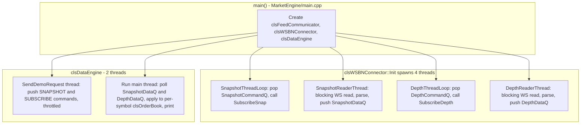
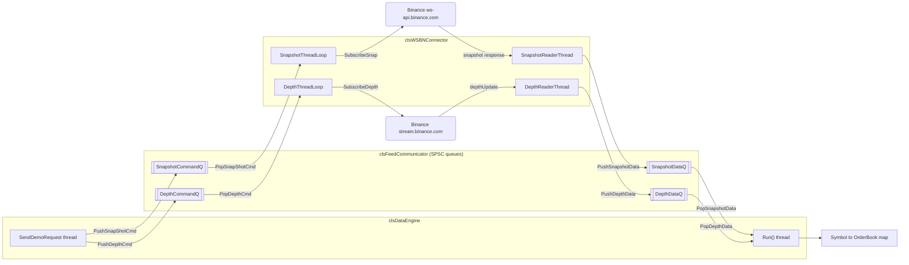
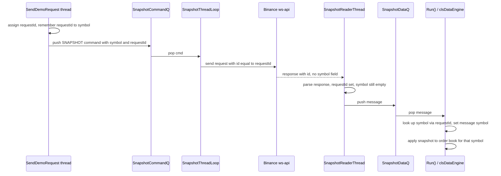

# MarketCore — Thread & Queue Model

Current architecture of the `market_engine_exe` process: `clsWSBNConnector` (Binance
WebSocket adapter) and `clsDataEngine` (order-book consumer), connected via
`clsFeedCommunicator`'s four SPSC queues.

## Thread topology

**Thread ownership rules:**
- `clsWSBNConnector` owns 4 threads: two "command loop" threads that dequeue subscribe
  commands and issue the actual Binance WS requests, and two "reader" threads that
  block on `websocket::read` and push parsed messages into the data queues.
- `clsDataEngine` runs the demo subscription pusher (`SendDemoRequest`) on its own
  thread, while `Run()` (the order-book consumer loop) owns the main thread.
- No thread ever touches another thread's queue as anything but producer or consumer
  — see queue table below for the exact pairing.

## Queue topology (`clsFeedCommunicator`)

**Queue rules (each is SPSC — single producer, single consumer):**

| Queue | Producer | Consumer | Carries |
|---|---|---|---|
| `SnapshotCommandQ` | `clsDataEngine::SendDemoRequest` | `clsWSBNConnector::SnapshotThreadLoop` | `stFeedCommand` (SNAPSHOT + requestId) |
| `DepthCommandQ` | `clsDataEngine::SendDemoRequest` | `clsWSBNConnector::DepthThreadLoop` | `stFeedCommand` (SUBSCRIBE) |
| `SnapshotDataQ` | `clsWSBNConnector::SnapshotReaderThread` | `clsDataEngine::Run` | `stMarketDataMessage` (SNAPSHOT) |
| `DepthDataQ` | `clsWSBNConnector::DepthReaderThread` | `clsDataEngine::Run` | `stMarketDataMessage` (INCREMENTAL_DEPTH_UPDATE) |

## Symbol correlation (snapshot has no symbol field)

## Notes / known gaps
- `m_mpSymToRequestId` in `clsDataEngine` is currently unguarded by a mutex even
  though it's written by `SendDemoRequest` thread and read by `Run()` thread — see
  `/memories/repo/cmake.md` and session notes; revisit if this becomes a real race
  in practice (map only grows via `SendDemoRequest`, is read-only afterward per key).
- No sync/bridging state machine yet (buffering deltas until snapshot arrives, gap
  detection, resync) — incremental updates are applied directly to whatever book
  exists in the map; if depth arrives before the matching snapshot, it's dropped
  with a "Symbol not found" log until the snapshot creates the map entry.
